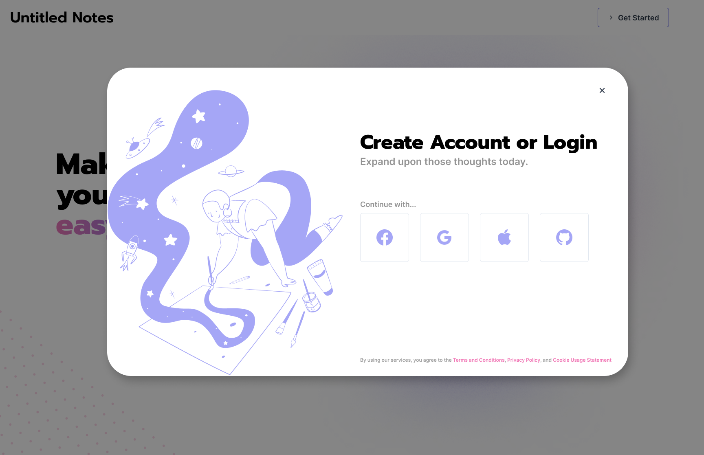

# Login Modal Style Guide



## Chakra components needed:

- IconButton (modified with the sx prop to fit the size)
- Text
- Grid
- GridItem
- Modal
- Link (best to use the Nextjs component rather than the ChakraUI Link)

## Info:

- The modal should appear upon the `onClick` event of the `Get Started` button on the navbar.
- The icons used for the logos are from [BoxIcons](https://boxicons.com/), these can easily be integrated into the `IconButton` components, see the [docs](https://chakra-ui.com/docs/form/icon-button#with-custom-icon) for more info.
- The svg illustration can be found within the `guide/images` folder.
- The colours used are `fuschia-main` and `iris-lightmode` as depicted in the [start-here.md](../start-here.md) file.
- The modal follows the font decisions found in the [start-here.md](../start-here.md) file, using `Prompt` for the header, and `Inter` for everything else.

## Snippets:

```tsx
/* Facebook/Google/Apple/GitHub buttons */

import 'boxicons';

<IconButton
  variant="outline"
  aria-label="Login with Facebook"
  fontSize="2rem"
  icon={<box-icon type="logo" name="facebook-round" color="iris-lightmode"></box-icon>}
  sx={{ padding: '2rem' }}
/>;
```

```tsx
/* Modal */

const LoginModal = () => {
  // These states would be controlled by the 'Get Started' button.
  const { isOpen, onOpen, onClose } = useDisclosure();

  return (
    <>
      <Modal isCentered onClose={onClose} isOpen={isOpen} motionPreset="slideInBottom">
        <ModalOverlay />
        <ModalContent>We would probably use a Grid component here</ModalContent>
      </Modal>
    </>
  );
};
```
