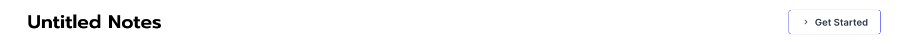
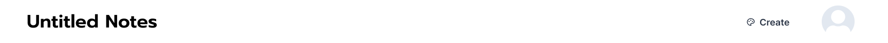

# Navbar Style Guidance

- The navbar should have a `white` background and have a `fixed` position.
- The navbar should have an `auth` state, which is either `true` or `false` utilising the useAuth hook. Depending on the state, it should display different options.

## States:

#### No authentication



#### User signed in / authenticated



---

## Info:

- Avatar size: `lg`
- Button size: `lg`
- Button variant: `link`
- Button icon: `palette-line`

---

## Snippets:

### Get Started Button

```tsx
<Button leftIcon={<ChevronRightIcon />} colorScheme="fuschia" variant="outline">
  Get started
</Button>
```

### Create Button (Uses the icon in images/create-icon.svg)

```tsx
import PaletteCreate from './images/create-icon.svg';

<Button leftIcon={<PaletteCreate />} variant="link" onClick={() => router.push('/create')}>
  Create
</Button>;
```
