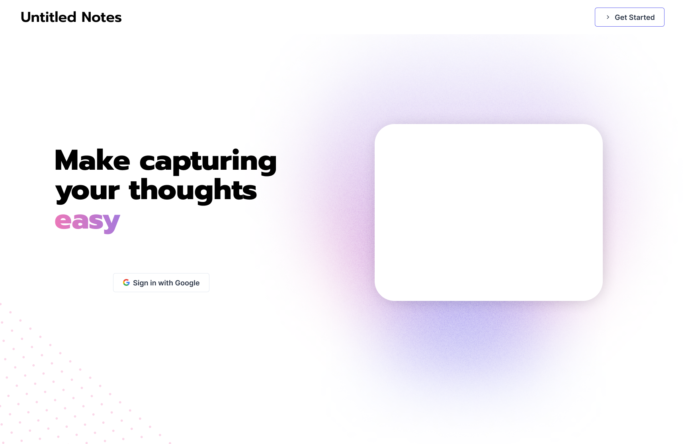

# Index / Landing Page



## Custom components needed:

- Navbar
- Preview Card
- Gradient (for background – found in `'images/textured-gradient.svg'`)
- Dots (for background – found in `'images/dots.svg'`)

## Chakra components needed:

- Button
- Grid
- GridItem
- Text
- Gradient (for text)

The hero text: `'make capturing your thoughts easy'` is using the `Prompt` font as set out in the [style guide](../start-here.md). The font-weight used is `800` (extrabold).

## Snippets:

### 'easy' text gradient:

```jsx
<Text bgGradient="linear(to-r, fuscia-lightmode, iris-lightmode)" bgClip="text" fontSize="6xl" fontWeight="extrabold">
  Easy
</Text>
```
